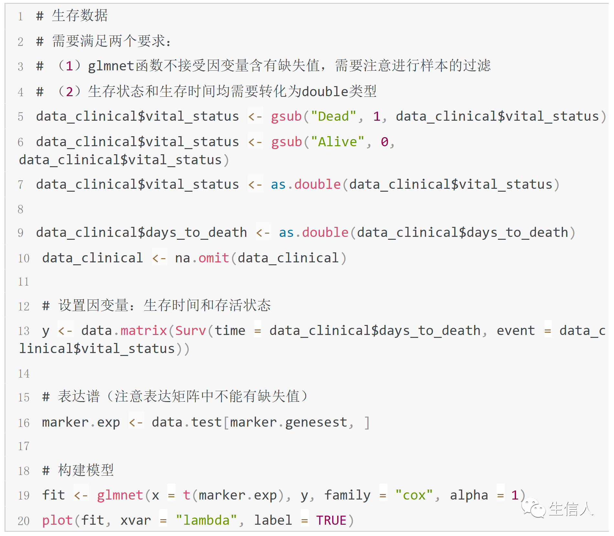
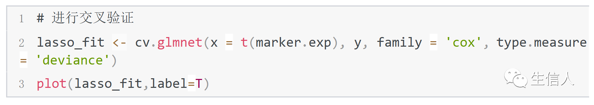
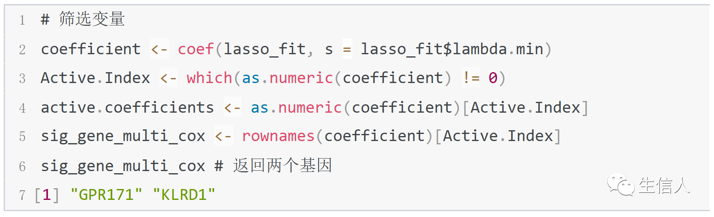

# 组学数据下游分析 {#downstream_analysis}
本章我们主要接受下游分析中常用的工具和方法：

## 计算差异表达基因
1. 组学数据差异表达分析比较适用的详细教程有：

## 差异表达基因的展示

2. 差异表达基因的展示：
2.1 计算出差异表达基因后，常用火山图进行展示：
```{r volcanoplot_examplecode, echo=TRUE,eval=FALSE}
library(ggplot2)
library(ggrepel)
data$adj.P.Val <- data$P.Value
data_subset$adj.P.Val <- data_subset$P.Value
data_subset <- data[data$`Gene name` %in% unique(merge_orig_ref_filter$`Gene name`),]
data_subset <- data_subset %>% subset(-log10(adj.P.Val) > -log10(0.01) & abs(logFC) > 1)
rownames(data_subset) <- data_subset$`Gene name`
data_subset_list <- list()
for (i in 1:6){
  gene_i <- rownames(merge_na_heatmap[which(merge_na_heatmap$Category == levels(merge_na_heatmap$Category)[i]),])
  data_subset_list[[i]] <- data_subset[which(data_subset$`Gene name` %in% gene_i),]
  print(dim(data_subset_list[[i]]))
}
subset_color <- c("#f8ecac","#edc7dd","#f8cbaa",
                  "#cad3e5","#e2eec6","#afdac7")
ggplot(data=data, aes(x=logFC, y =-log10(adj.P.Val),color=significant)) +
  geom_point(alpha=0.8, size=0.2,col="black")+
  geom_point(data=subset(data, logFC > 1 & adj.P.Val < 0.05),alpha=0.8, size=0.2,col="red")+
  geom_point(data=subset(data, logFC < -1&adj.P.Val < 0.05),alpha=0.8, size=0.2,col="blue")+
  labs(x="log2 (fold change)")+
  theme(plot.title = element_text(hjust = 0.4))+
  geom_hline(yintercept = -log10(0.05),lty=4,lwd=0.6,alpha=0.5)+
  geom_vline(xintercept = c(1,-1),lty=4,lwd=0.6,alpha=0.5)+
  theme_bw()+
  theme(panel.border = element_blank(),
        panel.grid.major = element_blank(),
        panel.grid.minor = element_blank(),
        axis.line = element_line(colour = "black")) +
  ylab("-log10(p.val)") + 
  #labs(title = "Volcano PLot of genes from matrisomeDB") + 
  #theme(plot.title = element_text(hjust=0.5,face = "bold",vjust = 1,size = 20)) + 
  theme(axis.title = element_text(face = "bold")) + 
  theme(text = element_text(face = "bold")) + 
  # geom_point(data=subset(data, abs(logFC) >= 6 & adj.P.Val < 0.05),alpha=0.8, size=3,col="green")+
  # geom_text_repel(data=subset(data, abs(logFC) > 6 & adj.P.Val < 0.05),
  #                 aes(label=gene),col="black",alpha = 0.8)
  geom_point(data=data_subset_list[[1]],alpha=0.85, size=1.5,col=subset_color[1])+
  geom_point(data=data_subset_list[[2]],alpha=0.85, size=1.5,col=subset_color[2])+
  geom_point(data=data_subset_list[[3]],alpha=0.85, size=1.5,col=subset_color[3])+
  geom_point(data=data_subset_list[[4]],alpha=0.85, size=1.5,col=subset_color[4])+
  geom_point(data=data_subset_list[[5]],alpha=0.85, size=1.5,col=subset_color[5])+
  geom_point(data=data_subset_list[[6]],alpha=0.85, size=1.5,col=subset_color[6])+
  geom_text_repel(data=data_subset,aes(label=gene),col="black",alpha = 0.8,size=3)

#coord_fixed(ratio = 2)
#library(export)
## 导成PPT可编辑的格式
graph2pdf(file="04_Output_figure/Version3/09_VolcanoPlot.pdf",aspectr=2, font = "Arial",
          width = 10, height = 8, bg = "transparent")
 
```
2.2 也常用heatmap进行展示：
可以参考多种热图的绘制方法：[heatmap](https://zhuanlan.zhihu.com/p/93826698)
2.3 热图绘制中，另一个比较大的方向就是热图的绘制，下面是我之前整理的一些code,如何从R获得想要的配色
```{r R_color,echo=TRUE,eval=FALSE}
#colors for clusters 
#(1)useage about ggsci:https://blog.csdn.net/m0_45248682/article/details/104077631
#根据说明书我们可以简单的将它们分成三类：pal,rgb,scale，前两个可以生成不同的颜色组，scale可以直接用与ggplot中
#ggplot+ scale_fill_aaas()

#(2) ggpubr:https://www.jianshu.com/p/c0ebba8d1853
#分布图、箱式图、条形图、小提琴图、点图

#(3) RColorBrewer
library(RColorBrewer)
#display.brewer.all()
#display.brewer.pal(10,"Set3")
#brewer.pal(7,"BrBG") #show the colors

#(4)specific figure colors for heatmap 
col_heatmap1 <- colorRampPalette(rev(c("Yellow", "black","#FF00FF")))(10)
col_heatmap2 <- colorRampPalette(rev(c("#67001F", "#B2182B", "#D6604D", "#F4A582",
                                       "#FDDBC7", "#FFFFFF", "#D1E5F0", "#92C5DE",
                                       "#4393C3", "#2166AC", "#053061")))(20)

#(5) color for Tcell 
cluster_col <- c("#E64B35FF","#4DBBD5FF","#E7298A","#3C5488FF","#7E6148FF",
                 "#BA55D3","#00A087FF","#FFA500","#B3DE69","#BEBADA","#000000","Yellow",brewer.pal(10,"Set3"))
cluster_col_v1 <- c("#E64B35FF","#4DBBD5FF","#E7298A","#3C5488FF","#7E6148FF","#00A087FF","#FFA500","#000000","Yellow",RColorBrewer::brewer.pal(8,"Dark2"),
                    RColorBrewer::brewer.pal(8,"Pastel1"))

#(6) color for PBMC 
my36colors <-c('#E5D2DD', '#53A85F', '#F1BB72', '#F3B1A0', '#D6E7A3', '#57C3F3', '#476D87',
               '#E95C59', '#E59CC4', '#AB3282', '#23452F', '#BD956A', '#8C549C', '#585658',
               '#9FA3A8', '#E0D4CA', '#5F3D69', '#C5DEBA', '#58A4C3', '#E4C755', '#F7F398',
               '#AA9A59', '#E63863', '#E39A35', '#C1E6F3', '#6778AE', '#91D0BE', '#B53E2B',
               '#712820', '#DCC1DD', '#CCE0F5',  '#CCC9E6', '#625D9E', '#68A180', '#3A6963',
               '#968175'
)
col_cluster<-c("#0073C2B2","#7876B1B2",
               "#EFC000B2","#3B3B3BB2",
               "#F39B7FB2","#4DBBD5B2","#EE4C97B2","#E64B35B2", #cd4
               "#8F7700B2","#FFDC91B2","#E18727B2", "#6F99ADB2", # cd8
               "#868686B2",
               "#7AA6DCB2","#3C5488B2",#NK
               "#91D1C2B2",'#00A087B2',"#20854EB2",#B cell
               "#8491B4B2","#BC3C29B2")


#(7) colors for hc and bc
colHC<- rgb(60, 84, 136, 130, maxColorValue=255)
colBD<- rgb(243, 155, 127, 160, maxColorValue=255)

#(8) cluster for monocyte:
cellcol_mono =c("#4f6980","#849db1","#91b3d7", "#a2ceaa","#bfbb60",
          "#86BCB6","#FF9D9A",'#ea8783',"#fbb04e")

cellcol_mono_new = c("#4f6980","#849db1","#BEBADA",
                               "#a2ceaa","#bfbb60",
                               "#86BCB6","#FF9D9A",'#f47942',"#fbb04e")

# show_col(c("red", "pink", "purple", "blue", "cyan", 
#            "green", "yellow",
#            "orange", "brown", "grey"))

```

## 富集分析

3. 计算完差异表达之后，下一步一般是进行[富集分析](http://yulab-smu.top/clusterProfiler-book/chapter2.html),可以参考富集分析的链接进行分析和展示。

## 生存分析

4. 有时也需要进行生存分析，筛选对临床预后有很好指示作用的markers
Lasso + Cox 生存分析模式
一、为什么需要用 Lasso + Cox 生存分析模式
一般我们在筛选影响患者预后的变量时，通常先进行单因素Cox分析筛选出关联的变量，然后构建多因素模型进一步确认变量与生存的关联是否独立。

但这种做法没有考虑到变量之间多重共线性的影响，有时候我们甚至会发现单因素和多因素Cox回归得到的风险比是矛盾的，这是变量之间多重共线性导致模型 失真的结果。并且，当变量个数大于样本量时（例如筛选影响预后的基因或突变位点，候选的变量数可能远超样本个数），此时传统的Cox回归的逐步回归、前 进法、后退法等变量筛选方法都不再适用。

因此，当变量之间存在多重共线性或者变量个数大于样本量时，需要用Lasso(Least absolute shrinkage and selection operator)回归首先进行变量的筛选，然后构建Cox回归模型分析预后影响，这就是Lasso + Cox 生存分析模式。

二、什么是 Lasso + Cox 生存分析模式
Lasso可以在模型参数估计的同时实现变量的选择，能够较好的解决回归分析中的多重共线性问题，并且能够很好的解释结果。
Lasso回归算法使用L1范数进行收缩惩罚，对一些对于因变量贡献不大的变量系数进行罚分矫正，将一些不太重要的变量的系数压缩为0，保留重要变量的系数大于0，以减少Cox回归中协变量的个数。

R 代码示例：
```{r R_lasso_cox,echo=TRUE,eval=FALSE}
library(glmnet)
library(survival)
```

```{r clinical0, echo = FALSE, out.width = "100%"}

```

```{r clinical1, echo = FALSE, out.width = "100%"}

```

```{r clinical2, echo = FALSE, out.width = "100%"}

```

