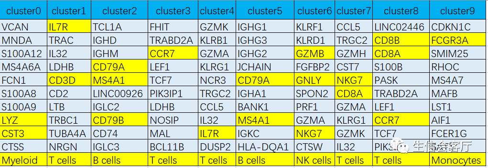
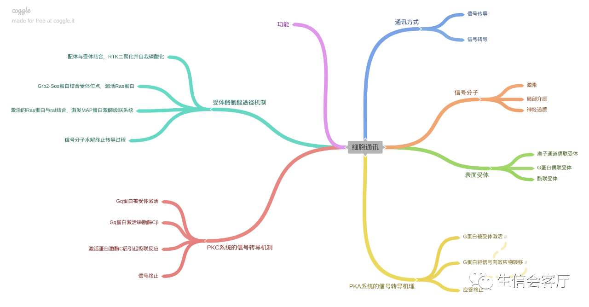
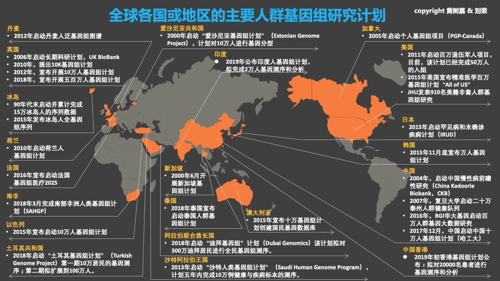

# 单细胞分析总结 {#scRNA-seq}

## 搭建单细胞环境
```{R scRNA_1, echo=TRUE,eval=FALSE}
install.packages("devtools", dependencies=T)
install.packages("BiocManager", dependencies=T)
install.packages("tidyverse", dependencies=T)
install.packages('Seurat', dependencies=T)
BiocManager::install(c("SingleR","monocle", "DESeq2"),ask = F,update = F) 
BiocManager::install(c("clusterProfiler","DOSE","pheatmap"),ask = F,update = F)
BiocManager::install(c("org.Hs.eg.db","org.Mm.eg.db","org.Rn.eg.db"),ask = F,update = F)
devtools::install_github('RGLab/MAST', upgrade=F, build_vignettes = T)
library(Seurat)
```
## 多样本合并与批次矫正
- Seurat
- Harmony：https://mp.weixin.qq.com/s/fLhTLia8g-O1L_btzgqMLA
- LIGER ： https://mp.weixin.qq.com/s/txnz-wfBk5vLpBiuGBnNTQ
- fastMNN： https://mp.weixin.qq.com/s/kqO5Cx5sScwHnSnKR6UH1Q


## 数据质控
https://mp.weixin.qq.com/s/ww-Wh80M54OKurfXoCNkUQ

- DoubletFinder
质控的过程中，也可以找到重复的细胞：https://mp.weixin.qq.com/s/V4IjVBpXA3jw9_HKrgq0ew

## 降维与聚类
- 可能需要细胞周期回归分析
https://mp.weixin.qq.com/s/77iajQfe7LibaApzrr8nkA
```{R echo=TRUE,eval=FALSE}
##如果需要消除细胞周期的影响
#scRNAb <- ScaleData(scRNA, vars.to.regress = c("S.Score", "G2M.Score"), features = rownames(scRNA))
```

## 细胞类型鉴定
人工鉴定细胞类型，首先要明确自己研究组织可能有哪些细胞类型，各种细胞的marker基因是什么，然后对比差异分析得到的各个cluster的显著高表达基因，综合分析就可以判断细胞类型了。细胞的marker基因主要通过相关领域的文献收集，也可以通过专门的数据库查找，推荐两个比较常用的数据库：
CellMarker：http://biocc.hrbmu.edu.cn/CellMarker/index.jsp
PanglaoDB：https://panglaodb.se/index.html
也可以用singleR 进行运行
```{r singleR, echo=FALSE, eval=FALSE,out.width= "100%"}
#https://github.com/dviraran/singler
#library(SingleR)
refdata <- MonacoImmuneData()  #人类免疫细胞数据
#refdata <- HumanPrimaryCellAtlasData() 人类细胞图谱
testdata <- GetAssayData(scRNAsub, slot="data")
clusters <- scRNAsub@meta.data$seurat_clusters
cellpred <- SingleR(test = testdata, ref = refdata, labels = refdata$label.fine, 
                     method = "cluster", clusters = clusters, 
                     assay.type.test = "logcounts", assay.type.ref = "logcounts")
```

还有另一种比较好的方法，用NMF的方法进行降维，NMF的因子可解释性更强，每个因子贡献度最大的基因基本代表了某种或某个状态细胞的表达模式，相比差异分析得到marker基因更有代表性。NMF找到的每个factor的基因名称，可能比差异表达计算出来的更加具有特异性。
https://mp.weixin.qq.com/s/zTQkKBXnJBB1SiEXMGHYwg


```{r cellsubtype, echo = FALSE, out.width = "100%"}

```

## 细胞再聚类
 - 提取细胞子集
 - 重新降维聚类（提高resolution）
 - SingleR细胞鉴定
 
 ## 拟时间分析
 - 拟时间相关基因聚类热图（与单个cluster分析）
 - BEAM 分析（与单个fate分析）
 Reference：https://mp.weixin.qq.com/s/ucLVmrQKajIpI8IBD5Of8A
 - monocle3：https://mp.weixin.qq.com/s/3wB4WOEv4REXKpjLXoXDBw

## RNA速率 
- 展示细胞分化的方向和速率：https://mp.weixin.qq.com/s/SbgS9Ckj6dIp_5wLhHPT-g

## 差异基因富集分析
 - GO 和 KEGG

## GSEA 和 GSVA 分析
- 可以得到单细胞层面每个细胞的GO结果图

 
## 转录调控网络
- regulon 活性评分与可视化
每个Regulon就是一个转录因子及其直接调控靶基因的基因集，SCENIC接下来的工作就是对每个regulon在各个细胞中的活性评分。评分的基础是基因的表达值，分数越高代表基因集的激活程度越高
Reference：https://mp.weixin.qq.com/s/QBBQ2TXQzNrjPILNi4EHdA

## 细胞通讯分析
```{r intersection, echo = FALSE, out.width = "100%"}

```
下面大部分的方法主要通过公关的配体和受体配对关系，一级配体、受体在细胞亚群的表达情况来推断细胞之间发生了那些通讯关系，
- CellPhoneDB
- celltalker
- iTALK
https://mp.weixin.qq.com/s/Z8-u64oxEPi8LtgTGG7YFg
- CellChat https://mp.weixin.qq.com/s/fCabT5MmmXk1aanAmcOiNQ
但是配体-受体相互作用如何导致受体细胞内下游靶基因表达变化可以用NicheNet
- NicheNet 

## scRNA数据分析CNV
https://mp.weixin.qq.com/s/CqQeZTOKTv-Pua7973LBYQ


## 整合VDJ 分析
https://mp.weixin.qq.com/s/YvFgneXjbjt7Ua9LBTdJWw

## 选marker，训练分类器
Garnett使用人工定义的marker基因信息来选择细胞，然后基于这些细胞使用弹性网络回归（elastic-net regression）的机器学习算法训练分类器。分类器中定义细胞类型的基因不仅有marker file中人工挑选的marker，还会增加一些机器学习得到的新marker，利用这些信息就可以对新数据集的细胞分类。
- Garnett https://mp.weixin.qq.com/s/tYNW86UsjM9quytLTxbmMA

## bulkRNA中细胞类型比例的R包
- xCell https://mp.weixin.qq.com/s/Sj2DKtUYWqx8U7qVYORt_Q

## 可以用TCGA 生存分析
通过scRNA分析得到新的marker基因，gene signatures，以及解释研究结论的基因集和代谢通路，一般都会用公共数据库的bulkRNA数据验证一下。我们这个专题所用数据的来源文章就利用TCGA数据对TFH signatures做了生存分析。
https://mp.weixin.qq.com/s/yFd2WWpO9V-clHIMUfajzg
生存分析常用指标总结： https://mp.weixin.qq.com/s/GlrIpoNypGqHFV_9DVH3iA
## 整合scATAC 分析
https://mp.weixin.qq.com/s/Kx5Ae9EUN1GAxtV_0ksWPw

## 单细胞可视化工具总结
 - https://mp.weixin.qq.com/s/9tOl8ov7lLAeM2omqLnw1w


## 好用的Reference:
0. 生物信息学基础知识：
http://www.biotrainee.com/jmzeng/book/basic/sequencing.html#methy-array

1. 单细胞流程pipeline 总结： http://bioconductor.org/books/release/OSCA/index.html

2. Broad institute scRNA pipeline 总结：
具有前端数据
https://broadinstitute.github.io/2019_scWorkshop/scrna-seq-experimental-design.html

3. ClusterProfile:
http://yulab-smu.top/clusterProfiler-book/index.html

4. 关于具体的实践，可以在我的百度云找到

5. 全球十大主要基因组学项目盘点
https://mp.weixin.qq.com/s/oocWezoXvhLTs6e6LMYO4Q
Conclusion as following:
```{r whole_world, echo = FALSE, out.width = "100%"}

```


## 思考
1. 范式思考规模、质与量 

